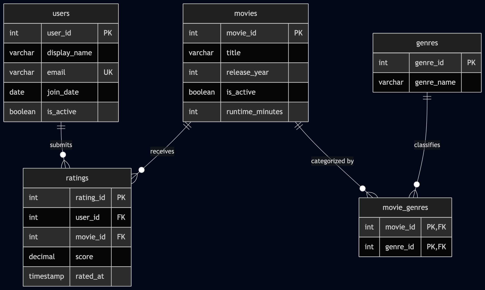

# EX603-Movie-TV-database
# Movie / TV Ratings & Analytics Platform

A relational database system designed and implemented in PostgreSQL 18 to model, store, and analyze user engagement, movie catalog metadata, and viewer ratings.

## Author
* **Course:** EX603 - Data and Algorithms for Scalable Systems
* **Theme:** Movie / TV

## System Overview & Domain
This database platform models a streaming/media discovery environment where users discover content, explore categorical genres, and submit numerical ratings for films and television shows. The system tracks user participation, rich media metadata, and high-volume rating events to provide actionable analytics for content managers and recommendation algorithms.

The platform answers critical business questions such as:
* Which movies and genres generate the highest average user engagement and ratings?
* How do individual user rating distributions shift over time across different content categories?
* What are the top-performing titles within specific genre combinations?

## Database Schema (5-Role Architecture)
* **Actor (`users`):** The primary user accounts interacting with the system.
* **Producer (`movies`):** The catalog of media titles being evaluated, containing metadata and activity flags.
* **Event (`ratings`):** The high-volume fact table capturing each individual rating score, user reference, and timestamp.
* **Catalog (`genres`):** Descriptive classification dimensions for media content.
* **Junction (`movie_genres`):** Resolves the many-to-many relationship linking movies to multiple genres.

### Key Design Decisions
* **I used soft deletes instead of hard deletes for users and movies.** Both `users` and `movies` have an `is_active` column instead of actually deleting the row when someone closes their account or a movie gets pulled. That way if a user leaves or a movie gets delisted, all the ratings tied to them stick around and don't just disappear.
* **The ratings table has different delete behavior depending on which side you're deleting.** If a user gets permanently deleted, their ratings get deleted with them, since a rating can't really exist without the person who made it. But if someone tries to permanently delete a movie, the database blocks it instead, so ratings don't get wiped out or left pointing at nothing by accident.
* **Ratings has its own id instead of using user_id and movie_id together as the key.** I gave `ratings` its own `rating_id` instead of making the primary key a combo of `user_id` and `movie_id`. I still added a `UNIQUE` constraint on `(user_id, movie_id)` so a user can't rate the same movie twice, but this way if someone changes their rating, it's just updating the row they already have instead of deleting and remaking it.



## Project Structure
```text
ex603-movie-tv-database/
├── README.md
├── schema/          # DDL scripts, ERD diagrams, and constraint documentation
├── queries/         # SQL query scripts organized by unit (unit3, unit4, unit5, unit6)
├── analysis/        # Markdown reflections and analytical writeups
└── screenshots/     # Execution evidence and verification output